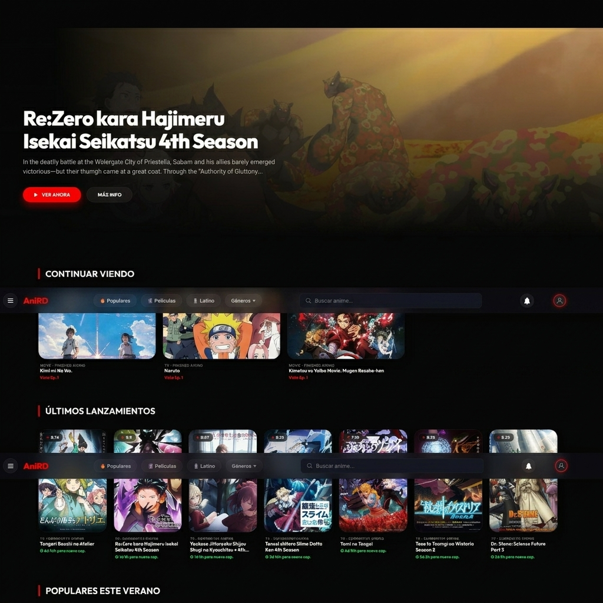

# AniRD - Anime Streaming Platform



AniRD es una plataforma moderna y minimalista para ver anime online, diseñada para ofrecer una experiencia premium con un enfoque en la legibilidad y la facilidad de uso.

## ✨ Características Principales

- **Diseño Premium (Big Revamp):** Interfaz oscura elegante con animaciones suaves y micro-interacciones.
- **Historial de Reproducción:** Página dedicada de historial para retomar tus series exactamente donde las dejaste.
- **Sistema de Favoritos:** Guarda tus animes preferidos para acceder a ellos rápidamente.
- **Integración con AniList:** Metadatos enriquecidos que incluyen puntuaciones, géneros, años de lanzamiento y estados de emisión.
- **Navegación Móvil:** Menú inferior optimizado para dispositivos móviles.
- **Buscador Inteligente:** Filtrado por categorías (Popular, Películas, Últimos, Latino) y búsqueda en tiempo real.
- **Selector de Servidores y Calidad:** Múltiples opciones para asegurar la mejor reproducción posible.

## 🚀 Inicio rápido

### Pre-requisitos
- Docker y Docker Compose instalados
- Node.js 20+ (solo para desarrollo local)

### Configuración inicial (obligatoria antes del primer arranque)
1. Copia el template de variables de entorno:
   ```bash
   cp .env.example .env
   ```
2. Edita `.env` y define `JWT_SECRET` con una clave segura:
   ```bash
   node -e "console.log(require('crypto').randomBytes(64).toString('hex'))"
   ```
3. Levanta los servicios:
   ```bash
   docker compose up -d --build
   ```
4. Abre http://localhost:8090

### Actualización en Orange Pi
```bash
cd ~/AniRD
git stash          # guarda cambios locales temporales
git pull           # descarga actualizaciones
git stash pop      # restaura cambios locales si los hay
docker compose down
docker compose up -d --build
```

## 🛠️ Tecnologías Utilizadas

- **Frontend:** HTML5, CSS3 (Vanilla), JavaScript (ES6+), PWA.
- **APIs:** Integración con Jikan API (MyAnimeList) y AniList para metadatos.
- **Backend:** Node.js (Anime1v API) sirviendo con caché en memoria y validación robusta.

## 📝 Changelog
Ver [CHANGELOG.md](./CHANGELOG.md) para el historial completo de versiones.

## 📲 Descargar App Móvil / Smart TV
Los APKs compilados y firmados están disponibles directamente en la sección de [GitHub Releases](../../releases). ¡No descargues el APK directo de la rama principal ya que podría estar desactualizado!

## 🤝 Créditos y Agradecimientos

Este proyecto es posible gracias a las increíbles APIs abiertas de la comunidad:

- **[Jikan API](https://jikan.moe/):** API oficial de MyAnimeList que utilizamos para la búsqueda global y datos generales.
- **[AniList API](https://anilist.gitbook.io/):** Utilizada para metadatos enriquecidos, puntuaciones y estados de emisión.
- **[Anime1v API](https://github.com/FxxMorgan/anime1v-api):** El motor original del backend adaptado para el streaming de contenidos.

---
*Desarrollado con ❤️ por adonyrd127* estados de emisión.
- **[Anime1v API](https://github.com/FxxMorgan/anime1v-api):** El motor original del backend adaptado para el streaming de contenidos.

---
*Desarrollado con ❤️ por adonyrd127*

