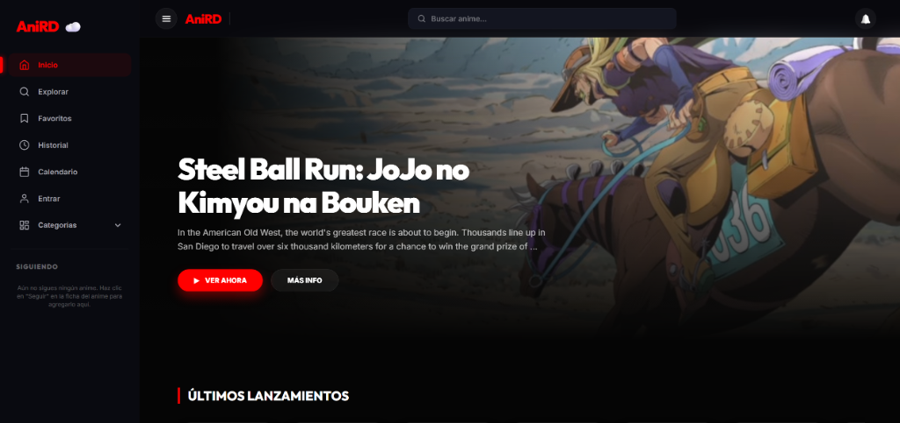
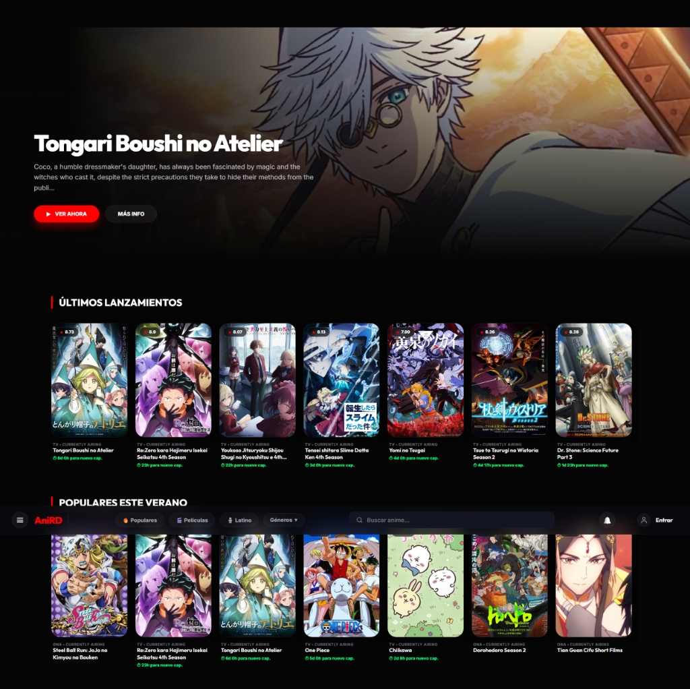
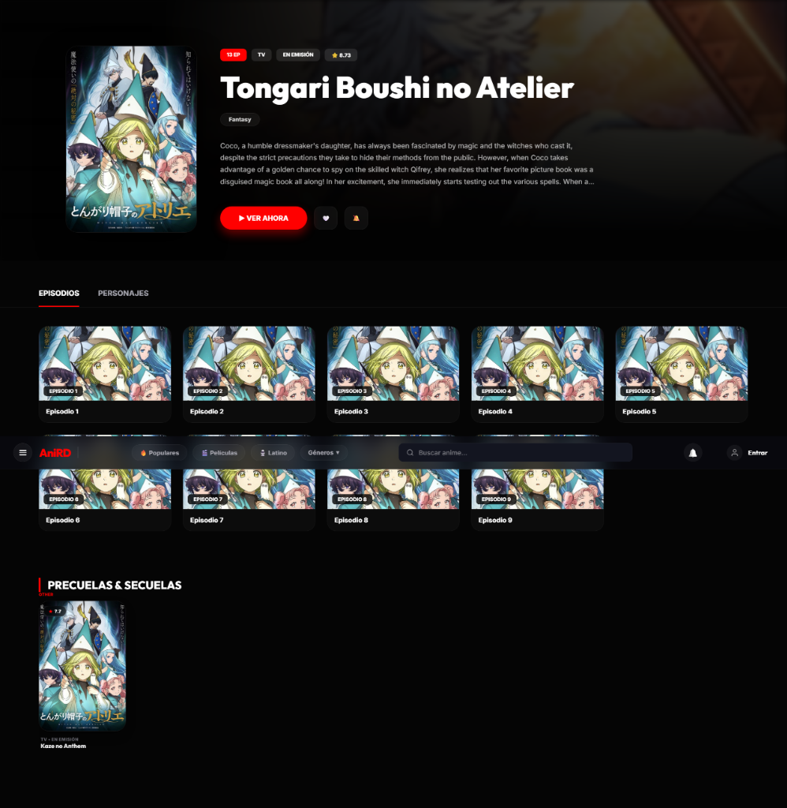
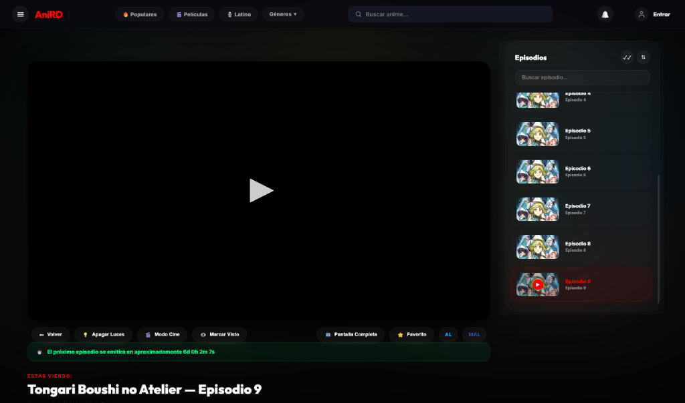

# AniRD - Anime Streaming Platform



AniRD es una plataforma moderna y minimalista para ver anime online, diseñada para ofrecer una experiencia premium con un enfoque en la legibilidad y la facilidad de uso.

## ✨ Características Principales

- **Diseño Premium (Big Revamp):** Interfaz oscura elegante con animaciones suaves y micro-interacciones.
- **Historial de Reproducción:** Página dedicada de historial para retomar tus series exactamente donde las dejaste.
- **Sistema de Favoritos:** Guarda tus animes preferidos para acceder a ellos rápidamente.
- **Integración con AniList:** Metadatos enriquecidos que incluyen puntuaciones, géneros, años de lanzamiento y estados de emisión.
- **Navegación Móvil:** Menú inferior optimizado para dispositivos móviles.
- **Buscador Inteligente:** Filtrado por categorías (Popular, Películas, Últimos, Latino) y búsqueda en tiempo real.
- **Selector de Servidores y Calidad:** Múltiples opciones para asegurar la mejor reproducción posible.

## 🚀 Inicio rápido

### Pre-requisitos
- Docker y Docker Compose instalados
- Node.js 20+ (solo para desarrollo local)

### Configuración inicial (obligatoria antes del primer arranque)
1. Copia el template de variables de entorno:
   ```bash
   cp .env.example .env
   ```
2. Edita `.env` y define `JWT_SECRET` con una clave segura:
   ```bash
   node -e "console.log(require('crypto').randomBytes(64).toString('hex'))"
   ```
3. Levanta los servicios:
   ```bash
   docker compose up -d --build
   ```
4. Abre http://localhost:8090

### Actualización en Orange Pi
```bash
cd ~/AniRD
git stash          # guarda cambios locales temporales
git pull           # descarga actualizaciones
git stash pop      # restaura cambios locales si los hay
docker compose down
docker compose up -d --build
```

## 🛠️ Tecnologías Utilizadas

- **Frontend:** HTML5, CSS3 (Vanilla), JavaScript (ES6+), PWA.
- **APIs:** Integración con Jikan API (MyAnimeList) y AniList para metadatos.
- **Backend:** Node.js (Anime1v API) sirviendo con caché en memoria y validación robusta.

## 🎨 Galería de la Interfaz Premium

### 🏠 Inicio (Sección Principal y Carruseles)



### 📋 Detalle de Anime (Episodios y Personajes)


### 🎬 Reproductor Inmersivo (Modo Ambiente)


## 📝 Notas de Versión Recientes

### v4.4.3 - Security, DevOps & Performance Update 🛡️⚡ (Nueva)
- **Seguridad Robusta (Production-Ready):** Encriptación y ocultamiento seguro de secretos en producción con Docker Compose interactuando con variables en un archivo `.env` dinámico.
- **Protección Anti-Fuerza Bruta:** Implementación de limitación de tasa de solicitudes (`express-rate-limit`) en los endpoints clave de autenticación del backend.
- **Control CORS Inteligente y Dinámico:** Whitelisting adaptativo para permitir conexiones locales (`localhost`) y redes privadas VPN remotas (Tailscale) de forma segura y automática sin bloquear la experiencia multi-dispositivo.
- **Docker Health Checks Nativos (Zero-Dependency):** Monitor de salud del backend integrado con comandos de Node nativos, eliminando la necesidad de empaquetadores CLI ausentes en imágenes docker slim.
- **Caché en Memoria Adaptativa (Performance Boost):** Integración de `node-cache` para almacenar en caché las respuestas pesadas de APIs externas (MAL/Jikan/AniList), reduciendo drásticamente los tiempos de carga y previniendo bloqueos por rate limits globales.
- **Registro Estructurado Ultra Veloz (Pino Logger):** Integración de `pino` y `pino-http` para generar registros limpios, estructurados y asíncronos que optimizan el rendimiento en arquitecturas ARM como tu Orange Pi.
- **Validaciones Estrictas con Zod:** Esquemas de seguridad declarativos para validar todos los parámetros de entrada y búsquedas en la API del backend, mitigando inyecciones y fallos de formato.
- **PWA de Alto Rendimiento (Offline Caching):** Soporte total para Service Workers en el frontend cargando assets estáticos clave, aislando las llamadas dinámicas a la API para evitar conflictos de sincronización.
- **Carga Diferida de Medios (Lazy Loading):** Incorporación de carga perezosa (`loading="lazy"`) y decodificación asíncrona en todas las imágenes de personajes y pósters de la página de detalles para una fluidez táctil y ahorro de banda.

### v3.8 - Cloud Sync & Premium Authentication Update 🔐
- **Rediseño Premium de Autenticación:** Interfaz de inicio de sesión y registro completamente reestructurada con estética Glassmorphism, sombreado de resplandor ambiental, campos de texto interactivos con foco reactivo en tiempo real, menú de pestañas estilo cápsula, animación de sacudida interactiva (`shake`) ante credenciales incorrectas y spinner animado para llamadas asíncronas.
- **Sincronización Inteligente Bidireccional (Two-Way Merge):** Fusión en dos vías entre IndexedDB y el backend de la Orange Pi comparando marcas de tiempo (`updatedAt` / `addedAt`) para unificar favoritos, historial y seguimiento de forma segura sin sobrescribir cambios recientes sin conexión.
- **Persistencia Antirruptura (Fetch Keepalive):** Configuración de llamadas a la API de sincronización con la bandera `{ keepalive: true }`, garantizando que el navegador complete la carga de datos al servidor incluso si el usuario cierra la pestaña o sale de la aplicación rápidamente.
- **Auto-Recuperación de Base de Datos:** Captura global de errores críticos de IndexedDB; si ocurre un bloqueo de versión o corrupción, el sistema borra de forma segura la base local y recarga la página para restaurar desde la nube de forma transparente.
- **Botón de Restablecimiento en Ajustes:** Nueva opción "Restablecer Local" en la pestaña de Ajustes del Perfil para depurar la base de datos local manualmente y forzar una resincronización limpia desde el servidor.
- **Navegación SPA en Logo:** El logo principal de AniRD en la barra superior se reestructuró con enrutamiento dinámico SPA para volver a la página de inicio instantáneamente sin recargas molestas del navegador.
- **Temporizador de 2 Minutos de Visualización Activa:** Medidor inteligente de 120 segundos que detiene el acumulador si la pestaña está oculta (`document.hidden`), con limpieza segura del hilo de ejecución en el enrutador para evitar fugas de memoria.

### v3.7 - Watched Episodes Update 👁️
- **Seguimiento Automatizado (Netflix Style):** Los episodios se marcan automáticamente como vistos al reproducirse. En el sidebar se muestra una barra de progreso roja llena al 100% en la base de la miniatura, un badge translúcido de `✓ Visto` con estética glassmorphic en la esquina superior, y una opacidad reducida al 65% para identificar visualmente qué episodios ya has consumido.
- **Botón de Marcado Manual de Episodio:** Añadido un botón premium `Marcar Visto` / `✓ Visto` en los controles principales del reproductor, sincronizado en tiempo real con IndexedDB.
- **Botón de Marcado de Temporada Completa:** Un nuevo botón `✓✓` en la cabecera del sidebar de episodios que permite marcar o desmarcar la temporada completa en bloque mediante transacciones ultra rápidas en IndexedDB, sin recargar el reproductor ni perder tu progreso.

### v3.6 - Premium Playback Update 🎬
- **Modo Ambiente (Cinematic Glow):** Resplandor ambiental de fondo dinámico y desenfocado basado en la imagen del anime activo, brindando una atmósfera inmersiva de cine.
- **Theater Mode (Modo Cine) Inteligente:** Redimensión del reproductor a tamaño completo usando posicionamiento CSS Grid puro para evitar recargar el iframe del video, reteniendo el progreso de la reproducción.
- **Apagar Luces (Dim Lights):** Overlay oscuro elegante al 94% sobre toda la página que resalta únicamente el reproductor de video para máxima concentración.
- **Selectores Premium Estilo Animex:** Reemplazo de los dropdowns estáticos clásicos por píldoras de botones interactivos para servidores (`Uwu`, `Mochi`, `Beep`) e idiomas (`Subtitulado` / `Latino`).
- **Ficha Técnica Ampliada & Cuenta Regresiva:** Detalles enriquecidos (Estudio, Duración, Episodios, Géneros) al lado del póster del anime con sinopsis expandible mediante un botón de "... ver más" inteligente, junto a un temporizador interactivo para próximos episodios en emisión.
- **Sidebar de Episodios con Miniaturas:** Rediseño completo del listado de episodios usando tarjetas horizontales con miniaturas y títulos dinámicos provistos por AniList, acompañados de un buscador en tiempo real y selector de orden.
- **Animes Recomendados:** Carrusel de sugerencias y recomendaciones de Jikan cargadas en paralelo en la parte inferior con skeletons de carga fluida.
- **Botón de Favorito IndexedDB:** Sincronización en tiempo real con IndexedDB mediante `dbService` directamente desde el panel de reproducción.

### v3.5 - The Discovery Update 🌟
- **Menú de Categorías Premium:** Reemplazo de enlaces estáticos por un menú desplegable (Dropdown) con 15 géneros y estética Glassmorphism, perfectamente alineado con la barra de navegación.
- **Sistema de Notificaciones Inteligente:** Nuevo ícono de campana en la barra superior. Un motor matemático `offline-first` calcula y te avisa exactamente cuándo se estrena un nuevo episodio de los animes que sigues, sin sobrecargar la API.
- **Conteo Regresivo Exacto:** Las tarjetas de animes en las secciones de Favoritos y Mi Perfil ahora muestran un temporizador en vivo (ej. "⏱ 3d 5h para nuevo cap.") con el tiempo exacto faltante para el próximo episodio.
- **Inicio Expandido (Home Page):** Se añadieron 3 nuevos carruseles ("Últimos Lanzamientos", "Animes en Latino", "Acción y Aventura") con carga en paralelo (0 retraso).
- **Desplazamiento Fluido (Scroll Buttons):** Implementación de botones laterales (❮ ❯) al pasar el ratón por los carruseles del inicio para deslizar horizontalmente al puro estilo Netflix.
- **Sincronización Perfecta de Episodios:** La página de detalles de anime ahora verifica en tiempo real con el servidor local para asegurarse de que los últimos episodios emitidos (ej. cap 8) no se oculten si Jikan/MAL va retrasado.
- **Optimización del Catálogo Latino:** Reestructuración de la búsqueda usando IDs de Productores (Crunchyroll/Funimation) en lugar de filtros de texto, devolviendo miles de resultados correctos en la categoría "Latino".

### v3.0 - The Cloud Update ☁️
- **Sincronización Multi-dispositivo:** Tus favoritos e historial ahora se guardan en tu Orange Pi y se sincronizan automáticamente en cualquier dispositivo.
- **Sistema de Cuentas:** Registro e inicio de sesión seguro con JWT y persistencia de datos.
- **Mi Biblioteca Personal:** Nueva sección en el perfil para gestionar animes seguidos y favoritos con una interfaz visual mejorada.
- **Estadísticas en Tiempo Real:** Contador de episodios vistos y animes en seguimiento directamente en tu perfil.
- **Estabilización de UI:** Corrección de parpadeos en animaciones y optimización de carga de componentes.

### v2.1 - Personalización y Seguimiento
- **Modo Claro (Light Theme):** Soporte completo para tema claro con corrección de contraste en textos, tarjetas y navegación.
- **Preferencias de Audio:** Selección inteligente entre Latino y Subtitulado que se aplica automáticamente al reproductor y episodios.
- **Sistema de Seguimiento:** Nueva sección "Siguiendo" en el perfil con **Reloj de Cuenta Regresiva** para próximos estrenos.
- **Buscador Rediseñado:** Botón de búsqueda tipo "píldora" con atajos de teclado y estética profesional.
- **Identidad Visual:** Implementación de Favicon personalizado para la marca AniRD.
- **Optimización:** Limpieza masiva de archivos obsoletos y mejora en la arquitectura de componentes.

### v2.0 - The Big Revamp
- Rediseño completo de la UI/UX inspirado en estándares modernos de streaming.
- Mejora crítica en la legibilidad de las tarjetas de episodios.
- Restauración completa de la funcionalidad de Historial.

## 📝 Historial Completo
Ver [CHANGELOG.md](./CHANGELOG.md) para la lista completa estructurada de parches.

## 📲 Descargar App Móvil / Smart TV
Los APKs compilados y firmados están disponibles directamente en la sección de [GitHub Releases](../../releases). ¡No descargues el APK directo de la rama principal ya que podría estar desactualizado!

## 🤝 Créditos y Agradecimientos

Este proyecto es posible gracias a las increíbles APIs abiertas de la comunidad:

- **[Jikan API](https://jikan.moe/):** API oficial de MyAnimeList que utilizamos para la búsqueda global y datos generales.
- **[AniList API](https://anilist.gitbook.io/):** Utilizada para metadatos enriquecidos, puntuaciones y estados de emisión.
- **[Anime1v API](https://github.com/FxxMorgan/anime1v-api):** El motor original del backend adaptado para el streaming de contenidos.

---
*Desarrollado con ❤️ por adonyrd127*

